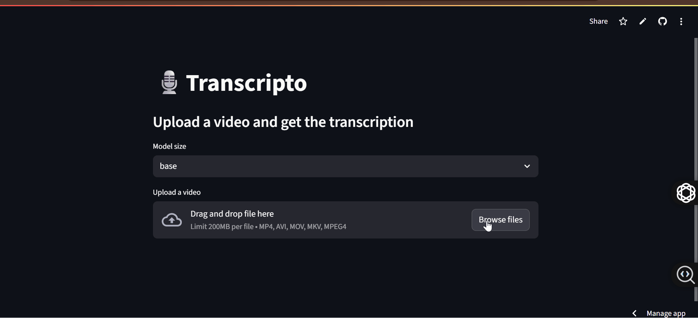

# 🎙️ Transcripto


A simple Streamlit app that transcribes videos into text using OpenAI’s **Whisper** model.

🌐 **[Live Demo on Streamlit Cloud](https://transcripto12.streamlit.app/)**

---

## ✨ Features

* 🎥 Upload video files (`.mp4`, `.avi`, `.mov`, `.mkv`)
* 🔊 Automatic audio extraction with **ffmpeg**
* 🧠 Transcribe speech into text using **Whisper**
* ⏱️ Accurate timestamps in `hh:mm:ss.ms` format
* 📥 Export transcription as:

  * `.txt` (Plain Text)
  * `.docx` (Word Document)
  * `.pdf` (Portable Document Format)
* ☁️ Free deployment on **Streamlit Cloud**

---

## 📸 Screenshots & Demo

### 🔹 Uploading a Video


### 🔹 Transcription Output


### 🔹 Download Options


*(You can also add a short **GIF demo** made with [ScreenToGif](https://www.screentogif.com/) or [OBS Studio](https://obsproject.com/) for better presentation.)*

---

## 📂 Project Structure

```
transcripto/
│── app.py              # Main Streamlit app
│── requirements.txt    # Python dependencies
│── packages.txt        # System packages (for Streamlit Cloud, includes ffmpeg)
│── runtime.txt         # Python runtime version (for Streamlit Cloud)
│── README.md           # Documentation
│── assets/             # Screenshots & demo GIFs
```

---

## 🚀 Usage

### 🔗 Online (Recommended)

1. Open the app 👉 [Live Demo](https://transcripto12.streamlit.app/)
2. Upload your video file
3. Select a Whisper model size (`tiny` → `large`)
   🔧 Tip: Use tiny or small for quick tests. Use medium or large for higher accuracy (but requires more time/memory).
5. Wait for transcription to finish
6. Download your transcript in `.txt`, `.docx`, or `.pdf`

---

## 🛠️ Installation (Local)

#### 1. Clone repo

```bash
git clone https://github.com/fns12/transcripto.git
cd transcripto
```

#### 2. Create & activate virtual environment

```bash
python -m venv venv
source venv/bin/activate   # Mac/Linux
venv\Scripts\activate      # Windows
```

#### 3. Install dependencies

```bash
pip install -r requirements.txt
```

#### 4. Install ffmpeg

* **Linux/macOS**

  ```bash
  sudo apt-get install ffmpeg
  ```

* **Windows** → Download from [ffmpeg.org](https://ffmpeg.org/download.html) and add to **PATH**

#### 5. Run the app

```bash
streamlit run app.py
```

---

## ☁️ Deployment (Streamlit Cloud)

This app is deployed on **Streamlit Cloud**:

* `requirements.txt` → Python dependencies
* `packages.txt` → includes `ffmpeg` so Streamlit installs it automatically
* `runtime.txt` → sets Python version (`3.9`)

---

## 🔄 Development Workflow

* ✅ Prototyped on **Google Colab** (to avoid RAM/GPU issues)
* ✅ Used **ngrok** for temporary live demos during testing
* ✅ Final version copied into `app.py`, pushed to GitHub
* ✅ Deployed on **Streamlit Cloud** for free & easy sharing

---

## 📝 Example Transcript

```
[00:00:01.200 → 00:00:03.450] Hello everyone, welcome to this session.
[00:00:04.000 → 00:00:06.150] Today we will be testing transcription.
```

---

## 📜 License

MIT License — Free to use and modify.


